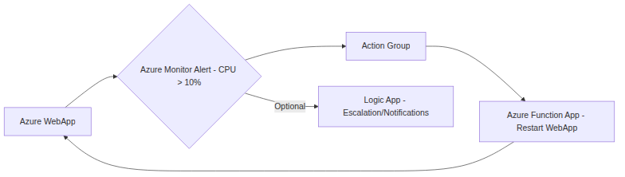

```markdown
# Azure WebApp High CPU Alert & Auto-Recovery Runbook

**Purpose:** This runbook outlines the steps to diagnose and remediate high CPU usage on an Azure WebApp, leveraging an Azure Function for automated recovery.

**Alert Name:** WebAppHighCPU

**Metric:** `CpuPercentage`

**Threshold:** > 10% for 5 minutes (configurable)

**Target Resource:** Azure WebApp `<WebAppName>`

**Runbook Version:** 1.0

## 1. Symptoms

*   **End-user perceived issues:**
    *   Slow website response times.
    *   Website unavailability or intermittent errors.
    *   Slow API response times.
*   **Observable Metrics:**
    *   `CpuPercentage` exceeding 10% in Azure Monitor.
    *   Elevated `RequestDuration` metric.
    *   Potential increase in `5xx` errors.
*   **Alerting System:**
    *   `WebAppHighCPU` alert triggered in Azure Monitor with severity level `Warning` or `Error` (configurable).
    *   Notifications sent to designated personnel (e.g., via email, Teams).

## 2. Troubleshooting

**2.1 Initial Investigation (5-10 minutes):**

*   **Verify Alert Details:**
    *   In Azure Monitor, review the alert instance details:
        *   Target resource (confirm it's the correct WebApp).
        *   Time of alert occurrence.
        *   Metric value and threshold.
    *   Check the alert history to determine frequency and duration of the CPU spikes.
*   **Azure Portal Overview:**
    *   Navigate to the WebApp in the Azure Portal.
    *   Review the "Overview" blade:
        *   CPU usage graph (confirm high CPU).
        *   Memory usage graph (check for memory pressure as a contributing factor).
        *   Data In/Out (check for excessive network activity).
        *   HTTP Errors (check for a correlation between CPU spikes and errors).
*   **Diagnose and Solve Problems:**
    *   In the WebApp's Azure Portal, use the "Diagnose and solve problems" blade.
    *   Select "Availability and Performance" -> "Web App Slow".  Azure provides automatic diagnostics and potential solutions.
*   **App Service Logs (if configured):**
    *   If Application Insights or WebApp logs are configured, check for:
        *   Exceptions and errors occurring during the CPU spike.
        *   Specific requests or operations that might be consuming excessive resources.
        *   Long-running processes.

**2.2 Deeper Dive (15-30 minutes):**

*   **Process Explorer (Kudu Console):**
    *   Access the Kudu console: `https://<WebAppName>.scm.azurewebsites.net/`
    *   Go to "Process Explorer":
        *   Identify the process(es) consuming the most CPU.  Typically, this will be `w3wp.exe` (IIS worker process).
        *   Note the PID (Process ID) of the high-CPU processes.
        *   Examine the process details (e.g., command line, threads).
*   **Debug Console (Kudu Console):**
    *   Use the Debug Console (CMD or PowerShell) to execute commands within the WebApp environment.
    *   **Identify running requests:** Use `appcmd list requests` to see active requests and their processing time.  This helps pinpoint slow endpoints.
    *   **Analyze environment variables:** Check environment variables for any misconfiguration that might contribute to the issue.
*   **Profiler (Application Insights, if configured):**
    *   If Application Insights is enabled, use the Profiler to collect traces of the running code.  This will pinpoint the specific code paths that are consuming the most CPU.
*   **Deployment Slots:**
    *   If using deployment slots, ensure the staging slot isn't also experiencing high CPU. If it is, the issue might be in the code or configuration being deployed.
    *   If only the production slot is affected, consider swapping to a known-good deployment from a previous slot to quickly mitigate the issue.

**2.3 Common Causes:**

*   **Code Issues:**
    *   Inefficient algorithms or code loops.
    *   Database query performance issues.
    *   Memory leaks leading to garbage collection overhead.
    *   Deadlocks.
*   **Increased Traffic:**
    *   Sudden surge in user traffic.
    *   Denial-of-service (DoS) attack (less likely at this relatively low CPU threshold, but possible).
*   **Configuration Issues:**
    *   Incorrect or insufficient resource allocation (e.g., App Service Plan size).
    *   Inefficient caching configuration.
    *   Too many connections to external resources (e.g., databases).
*   **External Dependencies:**
    *   Slow or unavailable database.
    *   Latency issues with other services the WebApp depends on.
*   **Background Tasks:**
    *   Scheduled tasks or background processes consuming excessive resources.

## 3. Auto-Remediation

**3.1 Azure Function - WebAppRestartFunction:**

*   **Function Description:** This Azure Function restarts the target WebApp.
*   **Function Trigger:** HTTP trigger (to be called by an Azure Monitor Action Group).
*   **Function Code (Python Example):**

```python
import logging
import azure.functions as func
import os
from azure.mgmt.web import WebSiteManagementClient
from azure.identity import DefaultAzureCredential

def main(req: func.HttpRequest) -> func.HttpResponse:
    logging.info('Python HTTP trigger function processed a request.')

    try:
        webapp_name = os.environ.get("WEBAPP_NAME")
        resource_group_name = os.environ.get("RESOURCE_GROUP_NAME")
        subscription_id = os.environ.get("SUBSCRIPTION_ID")

        if not webapp_name or not resource_group_name or not subscription_id:
            logging.error("Required environment variables WEBAPP_NAME, RESOURCE_GROUP_NAME, and SUBSCRIPTION_ID are not set.")
            return func.HttpResponse(
                 "Error: Missing required environment variables.",
                 status_code=500
            )

        credential = DefaultAzureCredential()
        client = WebSiteManagementClient(credential, subscription_id)

        client.web_apps.restart(resource_group_name, webapp_name)
        logging.info(f"WebApp {webapp_name} restarted successfully.")

        return func.HttpResponse(
             f"WebApp {webapp_name} restarted successfully.",
             status_code=200
        )

    except Exception as e:
        logging.exception(f"Error restarting WebApp: {e}")
        return func.HttpResponse(
             f"Error: {str(e)}",
             status_code=500
        )

if __name__ == "__main__":
    # Local Testing - Set environment variables manually
    os.environ["WEBAPP_NAME"] = "<YourWebAppName>"
    os.environ["RESOURCE_GROUP_NAME"] = "<YourResourceGroupName>"
    os.environ["SUBSCRIPTION_ID"] = "<YourSubscriptionId>"

    # Create a dummy HTTP request for testing
    class MockHttpRequest:
        def get_body(self):
            return b"test"

    req = MockHttpRequest()
    response = main(req)
    print(response.get_body())

```

*   **Configuration:**
    *   **Environment Variables:**
        *   `WEBAPP_NAME`: Name of the Azure WebApp to restart.
        *   `RESOURCE_GROUP_NAME`: Resource group containing the WebApp.
        *   `SUBSCRIPTION_ID`: Azure Subscription ID.
    *   **Managed Identity:**  Enable System-assigned Managed Identity for the Azure Function.
    *   **RBAC Permissions:** Grant the Managed Identity the `Web App Contributor` role on the WebApp resource (or at the resource group level).
*   **Action Group:**
    *   Create an Azure Monitor Action Group.
    *   Configure the action type as "Azure Function".
    *   Select the `WebAppRestartFunction`.
    *   Configure a retry policy in the Action Group.
*   **Alert Rule:**
    *   In the `WebAppHighCPU` alert rule, configure the Action Group created above to trigger when the alert is activated.

**3.2  How Auto-Remediation Works:**

1.  `CpuPercentage` exceeds 10% for 5 minutes.
2.  `WebAppHighCPU` alert is triggered in Azure Monitor.
3.  The Azure Monitor alert rule executes the configured Action Group.
4.  The Action Group triggers the `WebAppRestartFunction` via HTTP.
5.  The `WebAppRestartFunction` uses the Managed Identity to authenticate and restart the target WebApp.
6.  A log entry is written to the Function's logs indicating success or failure.
7.  If the restart resolves the CPU spike, the alert will resolve automatically.

**3.3 Post-Restart Verification:**

*   **Immediately After Restart:**
    *   Monitor the WebApp's CPU usage in the Azure Portal.
    *   Check the WebApp's availability and response times.
    *   Verify that the `WebAppRestartFunction` executed successfully (check Function logs).
*   **Short-Term (15-30 minutes):**
    *   Continuously monitor CPU usage to ensure the spike doesn't reoccur.
    *   Check Application Insights (if configured) for any errors or exceptions that might indicate an underlying problem.
*   **Long-Term:**
    *   Analyze the root cause of the high CPU usage (see Troubleshooting section).
    *   Implement permanent fixes to prevent recurrence.
    *   Adjust the alert threshold or auto-remediation strategy as needed.

## 4. Manual Remediation (if Auto-Remediation Fails)

If the auto-remediation fails to resolve the high CPU usage, perform the following manual steps:

1.  **Scale Up App Service Plan:**
    *   Increase the size/tier of the App Service Plan to provide more CPU resources.  This can often provide immediate relief.
2.  **Horizontal Scaling (Scale Out):**
    *   Increase the number of instances in the App Service Plan.  This distributes the load across multiple VMs.
3.  **Restart WebApp (Manually):**
    *   In the Azure Portal, navigate to the WebApp and click "Restart".  (This is essentially what the auto-remediation does, but sometimes a manual restart can be more effective).
4.  **Code Optimization:**
    *   If the root cause is identified as inefficient code, prioritize code optimization.  This may involve:
        *   Refactoring slow algorithms.
        *   Optimizing database queries.
        *   Fixing memory leaks.
        *   Implementing caching strategies.
5.  **Rollback Deployment:**
    *   If the high CPU usage started after a recent deployment, consider rolling back to the previous deployment.

## 5. Logs

**5.1 WebApp Logs:**

*   **Application Logs:** If using Application Insights or WebApp diagnostics logs, check for errors, exceptions, and warnings.
*   **IIS Logs:**  IIS logs provide detailed information about incoming requests, response codes, and processing times.  Analyze these logs to identify slow requests.
*   **Failed Request Tracing:**  Configure Failed Request Tracing in IIS to capture detailed information about requests that resulted in errors (e.g., slow processing, 500 errors).  This can be extremely helpful for pinpointing code issues.

**5.2 Azure Function Logs:**

*   Review the `WebAppRestartFunction` logs in Azure Monitor to confirm the function executed successfully and to identify any errors during the restart process.  Pay attention to any exceptions or error messages.

**5.3 Azure Monitor Alert History:**

*   Review the alert history for the `WebAppHighCPU` alert to track the frequency and duration of CPU spikes.  This helps identify trends and potential recurring issues.

**5.4 Kudu Console Logs:**

*   Kudu provides access to various logs, including:
    *   **Event Log:**  Check the Windows Event Log for any errors or warnings related to the WebApp.
    *   **LogFiles:**  Explore the `LogFiles` directory for various log files, including IIS logs and deployment logs.

## 6. Escalation

If the auto-remediation and manual remediation steps fail to resolve the high CPU usage, escalate the issue to the appropriate team:

*   **Development Team:**  For code-related issues (e.g., inefficient algorithms, memory leaks).
*   **Database Team:**  For database performance issues.
*   **Networking Team:**  For network-related issues (e.g., latency to external services).
*   **Azure Support:**  If the issue is suspected to be related to the Azure platform itself.

## 7. Prevention

*   **Code Reviews:** Conduct regular code reviews to identify and address potential performance issues early in the development process.
*   **Performance Testing:**  Implement performance testing as part of the CI/CD pipeline to identify performance bottlenecks before deployment.
*   **Monitoring and Alerting:**  Configure comprehensive monitoring and alerting to detect performance issues proactively.
*   **Auto-Scaling:**  Enable auto-scaling for the App Service Plan to automatically adjust the number of instances based on CPU usage.
*   **Optimize Database Queries:** Regularly review and optimize database queries to ensure efficient data retrieval.
*   **Regularly Review and Update Dependencies:** Keep dependencies up-to-date to benefit from performance improvements and security patches.

## 8. Runbook Review

This runbook should be reviewed and updated at least every 6 months, or whenever significant changes are made to the WebApp or its environment.  The review should include:

*   Verification of the alert threshold and auto-remediation strategy.
*   Updates to the troubleshooting steps based on recent experience.
*   Incorporation of any new tools or techniques for diagnosing and resolving high CPU usage.

This runbook provides a comprehensive guide for addressing high CPU usage on an Azure WebApp. Remember to customize the configuration and steps based on your specific environment and application requirements. Good luck!
```

## Architecture Diagram


