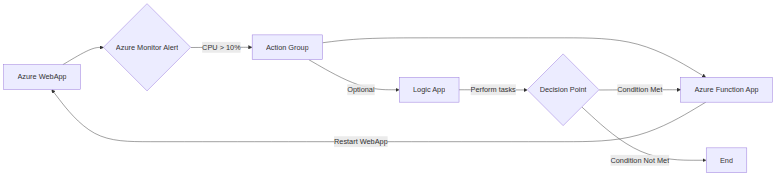

```markdown
# Azure WebApp High CPU Utilization Alert Runbook & Auto-Recovery

**Alert Name:** WebAppHighCPU

**Trigger Condition:** Average CPU Percentage > 10% for 5 minutes.

**Affected Resource:** Azure WebApp

**Runbook Version:** 1.0

**Last Updated:** 2023-10-27

**Author:** Azure Automation Team

**Purpose:** This runbook provides a detailed guide for responding to and resolving alerts related to high CPU utilization in an Azure WebApp. It includes steps for identifying the root cause, troubleshooting performance issues, and executing auto-remediation using an Azure Function.

## 1. Symptoms

*   **Slow Application Response Times:** Users may experience slow page load times or unresponsive application features.
*   **Application Errors:** The WebApp may return errors due to resource constraints.
*   **High CPU Utilization:** The WebApp's CPU usage consistently remains above 10%. This will be confirmed by the alert.
*   **Increased Latency:** Requests to the WebApp take longer to process.
*   **Degraded Performance:** Overall application performance is noticeably lower than usual.

## 2. Troubleshooting

### 2.1. Initial Investigation (Within 5 minutes of Alert)

1.  **Acknowledge the Alert:** Acknowledge the alert in the Azure Portal or your monitoring system to prevent redundant investigations.
2.  **Verify Alert Accuracy:**
    *   **Azure Portal:** Navigate to the WebApp's Overview page.
    *   **Monitoring:**  Examine the CPU Percentage metric chart.  Confirm that the CPU usage is indeed consistently above 10% for the last 5 minutes or more.
3.  **Check WebApp Health:**
    *   **Azure Portal:** Navigate to the WebApp's "Diagnose and Solve Problems" section.
    *   **Run Diagnostics:** Use the "Availability and Performance" and "Performance Bottlenecks" diagnostic tools. Review the recommendations.
4.  **Check App Service Plan Health:**
    *   **Azure Portal:** Navigate to the App Service Plan hosting the WebApp.
    *   **Monitoring:** Examine the App Service Plan's CPU Percentage and Memory Percentage metrics. High CPU usage on the App Service Plan indicates a broader issue affecting all WebApps on the plan.

### 2.2. In-Depth Analysis (If Initial Investigation Doesn't Resolve)

1.  **Azure Metrics Explorer:** Use Azure Metrics Explorer to investigate CPU usage in more detail.
    *   **Filter by Instance:** If the WebApp has multiple instances, filter the CPU Percentage metric by Instance to identify the instance experiencing high CPU usage.
    *   **Correlate Metrics:** Correlate CPU usage with other metrics like Memory Percentage, Request Count, and Data In/Out to identify potential causes (e.g., memory leaks, sudden traffic spikes).
    *   **Time Range:** Increase the time range to get a better historical perspective of CPU usage patterns.
2.  **Azure App Service Diagnostics:** Utilize the advanced diagnostic tools in the Azure Portal.
    *   **Proactive Monitoring:** Review the "Proactive Monitoring" section for potential issues.
    *   **Performance Issues:**  Use the "Performance Issues" detector to identify specific code paths or requests causing high CPU usage.
    *   **Diagnostic Logs:** Analyze diagnostic logs for errors or warnings that may indicate performance problems. Enable detailed logging if necessary.
3.  **Kudu (Advanced Users):** Kudu provides advanced debugging and diagnostic capabilities.
    *   **Access Kudu:** Navigate to `https://<your-webapp-name>.scm.azurewebsites.net/`
    *   **Process Explorer:** Use the Process Explorer to identify processes consuming high CPU. Note the process ID (PID).
    *   **Dumps:**  Create memory dumps of the identified processes for offline analysis using tools like PerfView or WinDbg.
    *   **Console:**  Use the Kudu console to run commands and gather more information about the WebApp's environment.
4.  **Application Insights (If Integrated):**
    *   **Performance Analysis:** Use Application Insights to analyze request performance, identify slow dependencies, and pinpoint performance bottlenecks in the application code.
    *   **Live Metrics Stream:**  Use Live Metrics Stream to observe real-time performance metrics and identify issues as they occur.
    *   **Profiling:**  Use the profiler to collect detailed call stacks and identify code paths consuming the most CPU time.
5.  **Possible Causes:**
    *   **Code Issues:** Inefficient code, memory leaks, or long-running operations.
    *   **Traffic Spike:** A sudden increase in traffic to the WebApp.
    *   **External Dependencies:** Slow or unresponsive external dependencies (e.g., databases, APIs).
    *   **Background Processes:** Resource-intensive background tasks.
    *   **CPU Starvation:** Contention for CPU resources with other WebApps on the same App Service Plan (if applicable).
    *   **Configuration Issues:** Incorrect application settings or misconfigured caching.
    *   **Security Threats:** Malicious attacks or compromised code.

## 3. Auto-Remediation

**Action:** Restart the Azure WebApp.

**Mechanism:** Azure Function triggered by the alert.

**Function App Name:** WebAppAutoRecoveryFunction

**Function Name:** RestartWebApp

**Permissions:** The Function App's Managed Identity needs the "Contributor" role (or a custom role with `Microsoft.Web/sites/restart/action`) on the WebApp.

**Configuration (Azure Function):**

*   **Trigger:** HTTP Trigger
*   **Authentication:** System Assigned Managed Identity
*   **Environment Variables:**
    *   `WEBSITE_NAME`: Name of the WebApp to restart (e.g., `my-webapp`).
    *   `RESOURCE_GROUP_NAME`: Resource Group the WebApp belongs to (e.g., `my-resource-group`).
    *   `SUBSCRIPTION_ID`: Subscription ID containing the WebApp (e.g., `xxxxxxxx-xxxx-xxxx-xxxx-xxxxxxxxxxxx`). *Best practice is to retrieve this from the context object during runtime*
*   **Code (Example - Python):**

```python
import logging
import azure.functions as func
import azure.mgmt.web
from azure.identity import DefaultAzureCredential
import os

def main(req: func.HttpRequest) -> func.HttpResponse:
    logging.info('Python HTTP trigger function processed a request.')

    try:
        website_name = os.environ["WEBSITE_NAME"]
        resource_group_name = os.environ["RESOURCE_GROUP_NAME"]
        # Use DefaultAzureCredential - automatically uses managed identity if available
        credential = DefaultAzureCredential()

        subscription_id = os.environ.get("SUBSCRIPTION_ID") # Consider retrieving programmatically

        if not subscription_id:
            logging.error("SUBSCRIPTION_ID environment variable is not set.")
            return func.HttpResponse(
                "Subscription ID not found in environment variables.",
                status_code=500
            )

        web_client = azure.mgmt.web.WebSiteManagementClient(credential, subscription_id)

        logging.info(f"Attempting to restart WebApp '{website_name}' in resource group '{resource_group_name}'.")
        web_client.web_apps.restart(resource_group_name, website_name)

        logging.info(f"WebApp '{website_name}' restarted successfully.")

        return func.HttpResponse(
             f"WebApp '{website_name}' restarted successfully.",
             status_code=200
        )

    except Exception as e:
        logging.exception(f"Error restarting WebApp: {e}")
        return func.HttpResponse(
             f"Error restarting WebApp: {e}",
             status_code=500
        )
```

**Note:** Replace placeholders (e.g., `my-webapp`, `my-resource-group`) with your actual values.  Also, make sure your requirements.txt file includes `azure-mgmt-web` and `azure-identity`.

**Alert Configuration:**

*   **Alert Rule:**  Configure an Azure Monitor alert rule that triggers the Azure Function when the CPU Percentage metric exceeds 10% for 5 minutes.
*   **Action Group:**  Configure an Action Group that includes the Azure Function as an action.  Use the HTTP trigger URL of the Function App.

**Important Considerations:**

*   **Impact:** Restarting the WebApp will cause a brief downtime for users.
*   **Frequency:**  Monitor the frequency of auto-remediations.  If the WebApp is being restarted frequently, it indicates a more serious underlying issue that requires investigation.
*   **Escalation:** If auto-remediation fails or the issue persists, escalate to the appropriate on-call team.

## 4. Logs

### 4.1. WebApp Logs

*   **Application Logs:**  Check the WebApp's application logs for errors, warnings, and performance information.
    *   **Azure Portal:** Navigate to the WebApp's "App Service Logs" section.
    *   **Log Stream:**  Use the Log Stream feature to view real-time logs.
    *   **File System Logs:**  Download log files from the `/LogFiles` directory.
*   **Web Server Logs:**  Examine the Web Server logs (e.g., IIS logs) for HTTP errors and performance metrics.
    *   **Azure Portal:** Navigate to the WebApp's "App Service Logs" section.
*   **Diagnostic Logs:**  Enable and analyze diagnostic logs for more detailed information about WebApp behavior.

### 4.2. Azure Function Logs

*   **Azure Portal:** Navigate to the Function App and select "Monitor".
*   **Invocation Logs:** View the logs for each function invocation to track the success or failure of the restart operation.
*   **Application Insights:** If Application Insights is integrated with the Function App, use it to analyze performance and identify any errors.

### 4.3. Azure Activity Log

*   **Azure Portal:** Navigate to the Azure Activity Log.
*   **Filter:** Filter by "Resource" to find events related to the WebApp and the Function App.
*   **Events:** Review the Activity Log for events such as WebApp restarts, function invocations, and permission changes.

## 5. Post-Mortem Analysis

After the incident is resolved, conduct a post-mortem analysis to identify the root cause of the high CPU utilization and prevent future occurrences.  Consider the following:

*   **Root Cause Analysis:**  Determine the underlying reason for the high CPU usage (e.g., code defect, traffic spike, dependency issue).
*   **Corrective Actions:**  Implement corrective actions to address the root cause (e.g., fix code bugs, optimize database queries, scale the WebApp).
*   **Preventive Measures:**  Implement preventive measures to avoid similar incidents in the future (e.g., improve monitoring, implement performance testing, implement rate limiting).
*   **Documentation Updates:**  Update this runbook with any lessons learned or new troubleshooting steps.

## 6. Escalation

If the auto-remediation fails to resolve the issue, or if the high CPU utilization persists after the restart, escalate to the following on-call team:

*   **Team:** [Specify On-Call Team Here]
*   **Contact:** [Specify Contact Information Here]

This runbook provides a comprehensive guide for addressing high CPU utilization alerts in an Azure WebApp. By following these steps, you can quickly diagnose and resolve performance issues, minimize downtime, and prevent future occurrences. Remember to customize this runbook to fit your specific environment and application requirements.
```

## Architecture Diagram


