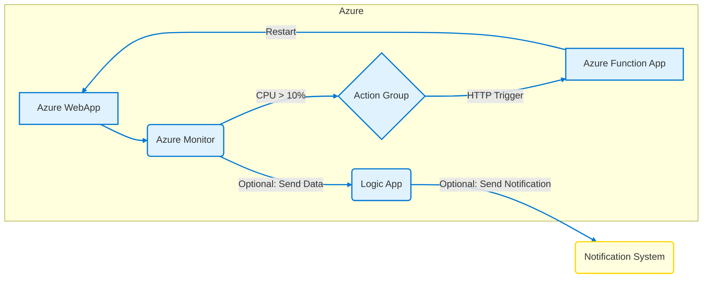

## Azure WebApp CPU Alert & Auto-Recovery Runbook

**Alert Name:** High CPU Usage - WebApp: [WebAppName]

**Description:** This runbook provides a detailed guide for handling an alert indicating high CPU usage on the Azure WebApp [WebAppName].  The alert triggers when CPU usage exceeds 10%. An Azure Function ([FunctionName]) is configured to automatically restart the WebApp if the CPU usage remains high after a specified duration.

**Runbook Version:** 1.0

**Last Updated:** October 26, 2023

**Authors:** [Your Name(s)]

**1. Alert Details**

*   **Alert Source:** Azure Monitor (Metric Alert)
*   **Target Resource:** Azure WebApp: [WebAppName]
*   **Metric:** `CpuPercentage`
*   **Threshold:** Greater than 10%
*   **Aggregation Type:** Average
*   **Period:** 5 minutes
*   **Evaluation Frequency:** 1 minute
*   **Alert Rule Status:** Enabled
*   **Action Group:** [Action Group Name] (Includes email notifications and triggers Azure Function [FunctionName])
*   **Function App Name:** [FunctionName]
*   **Function Name (within Function App):** [Function to Restart WebApp] (e.g., `RestartWebApp`)
*   **Resource Group:** [Resource Group of WebApp and Function App]
*   **Subscription ID:** [Subscription ID]
*   **Alert Status:** Fired/Resolved

**2. Symptoms**

*   **End-User Reported Issues:**
    *   Slow application response times.
    *   Application timeouts.
    *   General unresponsiveness.
    *   Error messages indicating server overload or resource exhaustion.
*   **Observed Behavior:**
    *   High CPU utilization on the WebApp instance.
    *   Increased request latency in Application Insights.
    *   Potential increase in error rates in Application Insights.
    *   Elevated queue lengths (if the WebApp uses queues).
    *   Slow database queries (if the WebApp interacts with a database).
*   **Alert Indication:**  Azure Monitor Metric Alert for `CpuPercentage` on [WebAppName] exceeding 10%.

**3. Troubleshooting Steps**

*   **3.1 Initial Investigation (5 Minutes)**
    *   **Check Alert Details:**  Verify the alert details in Azure Monitor for the precise timestamp, resource, and threshold.  Ensure the alert is for the correct WebApp.
    *   **Check Current CPU Usage:**
        *   Navigate to the WebApp in the Azure Portal.
        *   Go to `Monitoring` -> `Metrics`.
        *   Select `CpuPercentage` as the metric.
        *   Set the time range to the last 15 minutes.  Confirm the high CPU usage.
    *   **Check Application Insights (if configured):**
        *   Navigate to the WebApp in the Azure Portal.
        *   Go to `Application Insights`.
        *   Investigate the `Performance` section for high response times, slow operations, and potential bottlenecks.
        *   Check the `Failures` section for increased error rates.
        *   Examine `Live Metrics Stream` for real-time CPU usage and request rates.
*   **3.2 Detailed Analysis (15-30 Minutes)**
    *   **Identify CPU-Intensive Processes:**
        *   **Use Kudu (SCM) Console:**
            *   Navigate to the WebApp in the Azure Portal.
            *   Go to `Development Tools` -> `Advanced Tools`.
            *   Click `Go`.  This opens the Kudu console.
            *   Go to `Process Explorer`.  Identify the processes consuming the most CPU.
            *   Alternatively, use the Kudu debug console to run `ps` or `top` commands.
        *   **Application Profiling (if available):**  If application profiling is enabled (e.g., using Application Insights Profiler), analyze the CPU usage by methods and functions to pinpoint performance bottlenecks in the code.
    *   **Analyze Application Logs:**
        *   Check the WebApp's application logs for errors, warnings, and performance-related messages.  Look for long-running operations or excessive resource consumption.
        *   Use Azure Log Analytics to query the logs:
            ```kusto
            AppTraces
            | where CloudRoleName == "[WebAppName]"
            | where SeverityLevel >= 3 // Error and above
            | project Timestamp, Message
            | order by Timestamp desc
            ```
        *   Examine the logs for database queries (if applicable) to identify slow or inefficient queries.
    *   **Investigate External Dependencies:**
        *   If the WebApp relies on external services (databases, APIs, etc.), check their availability and performance. Slow responses from external services can contribute to high CPU usage.
        *   Monitor the latency of calls to these external services in Application Insights.
    *   **Check for Resource Leaks:**
        *   Examine the application code for potential resource leaks (e.g., memory leaks, unclosed database connections). These leaks can gradually increase CPU usage over time.

**4. Auto-Remediation**

*   **Azure Function ([FunctionName]) Trigger:**  The Azure Function [FunctionName] is triggered by the Azure Monitor Alert Action Group.
*   **Function Logic:**
    *   The function receives the alert details as input.
    *   It authenticates against Azure Resource Manager (ARM) using a Managed Identity or Service Principal.
    *   It executes the `Restart-WebApp` cmdlet in PowerShell, targeting the WebApp [WebAppName].
    *   It logs the restart attempt to Azure Monitor Logs for auditing purposes.
*   **Verification:**
    *   After the function executes, monitor the WebApp's CPU usage in the Azure Portal. The CPU usage should decrease after the restart.
    *   Check the execution logs of the Azure Function in the Azure Portal (`Monitoring` -> `Logs`) for successful execution.
    *   Verify that the WebApp is responding to requests.

**5. Manual Remediation (if Auto-Remediation Fails)**

*   **5.1 Restart the WebApp Manually:**
    *   Navigate to the WebApp in the Azure Portal.
    *   Click the `Restart` button.
    *   Monitor the CPU usage after the restart.
*   **5.2 Scale Up/Out the WebApp Service Plan:**
    *   If the issue persists, consider scaling up the App Service Plan to a higher tier with more CPU and memory resources.
    *   Navigate to the App Service Plan associated with the WebApp.
    *   Click `Scale up (App Service Plan)`.
    *   Select a higher tier (e.g., from S1 to S2).
    *   Alternatively, scale out by increasing the number of instances. Navigate to the App Service Plan, click `Scale out (App Service Plan)` and increase the instance count.
*   **5.3 Optimize Application Code:**
    *   Work with the development team to identify and optimize CPU-intensive sections of the application code.
    *   Implement caching strategies to reduce database load and improve response times.
    *   Refactor code to improve efficiency and reduce resource consumption.
*   **5.4 Diagnose with Snapshot Debugging (Application Insights):**
    *   If Application Insights is configured, use Snapshot Debugging to automatically collect debug snapshots when exceptions occur.  This can provide valuable insights into the root cause of the issue.
*   **5.5 Disable/Throttle Problematic Features:**
    *   If a specific feature or module is identified as the source of the high CPU usage, temporarily disable or throttle it to alleviate the issue.

**6. Logs**

*   **WebApp Application Logs:** Stored in Azure Blob Storage (if configured) or accessible via Kudu.
*   **Azure Function Execution Logs:** Accessible in the Azure Portal under the Function App -> `Monitoring` -> `Logs`.  Use Azure Monitor Logs to query these logs:
    ```kusto
    AppTraces
    | where OperationName == "[Function to Restart WebApp]"
    | project Timestamp, Message, Properties
    | order by Timestamp desc
    ```
*   **Azure Monitor Alert Logs:**  Accessible in the Azure Portal under `Monitor` -> `Alerts`.
*   **Application Insights Logs:** Accessible in the Azure Portal under the Application Insights resource.

**7. Post-Incident Analysis**

*   **Root Cause Analysis:** Determine the underlying cause of the high CPU usage.  Was it a code issue, a configuration problem, a sudden increase in traffic, or an external dependency issue?
*   **Preventative Measures:** Implement measures to prevent future occurrences of the issue.  This may involve code optimization, configuration changes, scaling adjustments, or improved monitoring.
*   **Runbook Updates:** Update this runbook with lessons learned and improved remediation steps.
*   **Monitoring Improvements:**  Consider adjusting the alert thresholds or adding new monitoring metrics to provide earlier warning of potential issues.

**8. Azure CLI/PowerShell Commands (Examples)**

*   **Restart WebApp (PowerShell):**
    ```powershell
    Restart-WebApp -Name "[WebAppName]" -ResourceGroupName "[Resource Group Name]"
    ```

*   **Get WebApp CPU Metrics (Azure CLI):**
    ```azurecli
    az monitor metrics list --resource "/subscriptions/[Subscription ID]/resourceGroups/[Resource Group Name]/providers/Microsoft.Web/sites/[WebAppName]" --metric "CpuPercentage" --aggregation Average --interval PT1M --start-time $(date -v-15M +"%Y-%m-%dT%H:%M:%SZ") --end-time $(date +"%Y-%m-%dT%H:%M:%SZ")
    ```

*   **Example Azure Function Code (PowerShell) - Restart WebApp:**

```powershell
# InputData contains the alert payload from Azure Monitor
param($InputData, $TriggerMetadata)

try {
    #Requires -Modules Az.Websites

    # Authenticate to Azure using Managed Identity
    Connect-AzAccount -Identity

    # Extract Web App Name and Resource Group Name from Alert Payload
    $alert = ConvertFrom-Json -InputObject $InputData

    # Extract Web App Name and Resource Group from the Alert
    $webappName = $alert.data.context.resourceName
    $resourceGroupName = $alert.data.context.resourceGroupName

    # Restart the Web App
    Restart-WebApp -Name $webappName -ResourceGroupName $resourceGroupName -Force

    Write-Host "Successfully restarted Web App: $webappName in Resource Group: $resourceGroupName"

    # Log success
    Write-Host "Restart Web App Completed" -InformationAction Continue

} catch {
    Write-Host "Failed to Restart Web App" -ErrorAction Continue
    Write-Host $_.Exception.Message -ErrorAction Continue

    # Log the error
    Write-Error "Failed to restart Web App: $($_.Exception.Message)"
    throw
}

```

**9.  Contact Information**

*   [On-Call Engineer/Team Name]
*   [Contact Email Address]
*   [PagerDuty/Alerting System Contact]

**10. Appendix**

*   Links to relevant documentation (e.g., Azure Monitor documentation, Application Insights documentation, Azure App Service documentation).
*   Diagram of the architecture of the WebApp and its dependencies.

**Important Considerations:**

*   **False Positives:**  Ensure the alert threshold is appropriate to avoid false positives. Consider adding logic to the Azure Function to confirm sustained high CPU usage before restarting the WebApp.
*   **Impact of Restart:**  Understand the impact of restarting the WebApp on active users.  Consider implementing graceful shutdown procedures to minimize disruption.
*   **Security:**  Ensure the Azure Function has the appropriate permissions to restart the WebApp. Use Managed Identities for authentication whenever possible.
*   **Testing:**  Regularly test the auto-remediation workflow to ensure it is functioning correctly. Simulate high CPU usage and verify that the Azure Function is triggered and restarts the WebApp.
*   **Monitoring the Function:** Monitor the execution of the Azure Function itself to ensure it is running reliably. Set up alerts for function failures.
*   **Database Impact:**  Excessive restarts of the WebApp can impact database connections and performance. Monitor database health and performance closely.

This runbook provides a comprehensive framework for addressing high CPU usage alerts on Azure WebApps.  Remember to customize it with specific details relevant to your application and environment.  Regularly review and update this runbook to ensure it remains effective and relevant.

## Architecture Diagram (Mermaid)


**Explanation:**

* **Azure WebApp (A):** The Azure WebApp being monitored.
* **Azure Monitor (B):**  Monitors the WebApp's CPU usage.
* **Action Group (C):**  Triggered by Azure Monitor when CPU usage exceeds 10%.  Configured to call the Azure Function.
* **Azure Function App (D):** Contains the function that's triggered by the Action Group.  The function's primary purpose is to restart the Azure WebApp.
* **Logic App (E - Optional):** This is an optional component. If included, Azure Monitor can send data to a Logic App before/instead of the Function App. The Logic App can then perform more complex logic, such as sending a notification or taking other actions.
* **Notification System (F - Optional):** Represents any system (e.g., email, Teams, Slack) that could receive a notification from the Logic App (if used).

**How it Works:**

1. **Monitoring:** Azure Monitor constantly monitors the CPU usage of the Azure WebApp.
2. **Alert Trigger:**  If the CPU usage exceeds 10%, Azure Monitor triggers an alert.
3. **Action Group Execution:** The alert triggers the configured Action Group.
4. **Function Invocation:** The Action Group triggers the Azure Function using an HTTP trigger.
5. **WebApp Restart:**  The Azure Function executes the code to restart the Azure WebApp.  This typically involves using the Azure Resource Manager (ARM) API or the Azure CLI.
6. **Optional Notification:** The Logic App, if used, can receive data from Azure Monitor and then send a notification to a designated system (e.g., email or a chat application) to inform stakeholders about the high CPU and the restart action.

**Key Considerations:**

* **Throttling:** Implement proper error handling and retry logic within the Azure Function to handle potential throttling by the ARM API.
* **Permissions:**  The Azure Function's managed identity or service principal needs appropriate permissions to restart the Azure WebApp (e.g., `Microsoft.Web/sites/restart/action`).
* **Configuration:**  The Action Group needs to be properly configured to call the Azure Function endpoint.
* **Monitoring & Logging:** Monitor the Azure Function and Logic App (if used) to ensure they are working as expected and to troubleshoot any issues.
* **Alternative Actions:** Instead of a restart, consider other actions like scaling up the App Service plan or auto-healing if the issues persist.
* **Alert Threshold:** The 10% CPU threshold should be chosen based on your application's normal operating range and performance requirements.
```
